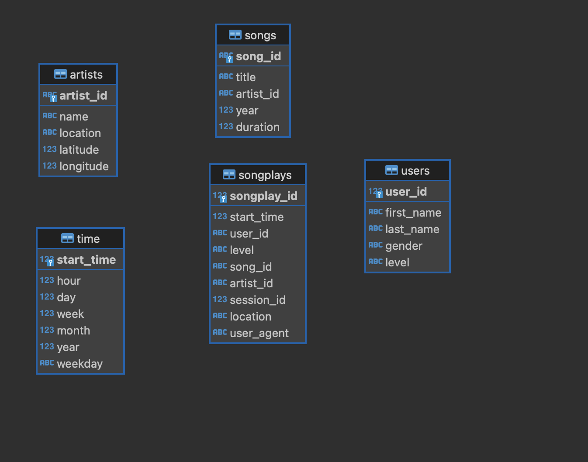

# Data Modeling with Postgres


## Project Description

In this project, I apply what you've learned on data modeling with Postgres and build an ETL pipeline using Python. 
To complete the project, you will need to define fact and dimension tables for a star schema for a particular analytic focus, 
and write an ETL pipeline that transfers data from files in two local directories into these tables in Postgres using Python and SQL.

## Schema



### How to run scripts

First of all, inicialize an environment virtual, using the script:
 
``` bash 
make install & source venv/bin/activate
```

Inicialize the postgres in docker

executar docker compose:
``` bash
 docker-compose -f docker-compose-postgres.yml up -d 
```


