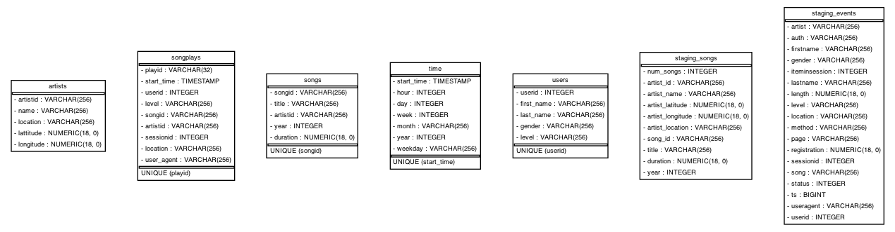

## Project: Data Pipelines with Airflow
A music streaming company, Sparkify, has decided that it is time to introduce more automation and monitoring to their data warehouse ETL 
pipelines and come to the conclusion that the best tool to achieve this is Apache Airflow.

They have decided to bring you into the project and expect you to create high grade data pipelines that are dynamic and built from 
reusable tasks, can be monitored, and allow easy backfills. They have also noted that the data quality plays a big part when analyses are executed 
on top the data warehouse and want to run tests against their datasets after the ETL steps have been executed to catch any discrepancies in the datasets.

The source data resides in S3 and needs to be processed in Sparkify's data warehouse in Amazon Redshift. The source datasets consist of JSON logs that 
tell about user activity in the application and JSON metadata about the songs the users listen to.

## Pipeline data in the Airflow


## Data Sources

- Log_data: `Log data: s3://udacity-dend/log_data`
- Song_data: `Song data: s3://udacity-dend/song_data`

## Data Target

the purpose of using airflow is to build a pipeline that will extract data into S3 and load in the Redshift (AWS).

**Stage table**

- Stage_events
- Stage_songs

**Dimension tables:**

- users 
- songs 
- artists 
- time 

**Fact table:**

- songplays

## Data Model



## Operators

### Stage Operator
The stage operator is expected to be able to load any JSON formatted files from S3 to Amazon Redshift. The operator creates and runs a SQL COPY statement based on the parameters provided. The operator's parameters should specify where in S3 the file is loaded and what is the target table.

### Fact and Dimension Operators
With dimension and fact operators, you can utilize the provided SQL helper class to run data transformations. Most of the logic is within the SQL transformations and the operator is expected to take as input a SQL statement and target database on which to run the query against. You can also define a target table that will contain the results of the transformation.

### Data Quality Operator
The final operator to create is the data quality operator, which is used to run checks on the data itself. The operator's main functionality is to receive one or more SQL based test cases along with the expected results and execute the tests. For each the test, the test result and expected result needs to be checked and if there is no match, the operator should raise an exception and the task should retry and fail eventually.

## File Structure

``` bash
data-pipeline-with-airflow
├── README.md
├── airflow
│   ├── dags
│   │   ├── __pycache__
│   │   │   ├── create_table_redshift_dag.cpython-37.pyc
│   │   │   ├── load_data_from_s3_to_redshift.cpython-37.pyc
│   │   │   └── test.cpython-37.pyc
│   │   └── load_data_from_s3_to_redshift.py
│   └── plugins
│       ├── __init__.py
│       ├── __pycache__
│       │   └── __init__.cpython-37.pyc
│       ├── helpers
│       │   ├── __init__.py
│       │   ├── __pycache__
│       │   │   ├── __init__.cpython-37.pyc
│       │   │   └── sql_queries.cpython-37.pyc
│       │   └── sql_queries.py
│       └── operators
│           ├── __init__.py
│           ├── __pycache__
│           │   ├── __init__.cpython-37.pyc
│           │   ├── data_quality.cpython-37.pyc
│           │   ├── load_dimension.cpython-37.pyc
│           │   ├── load_fact.cpython-37.pyc
│           │   └── stage_redshift.cpython-37.pyc
│           ├── data_quality.py
│           ├── load_dimension.py
│           ├── load_fact.py
│           └── stage_redshift.py
├── config
├── create_tables.sql
├── images
│   ├── example-dag.png
│   └── sparkify_erd.png
├── src
│   ├── __pycache__
│   │   └── config.cpython-39.pyc
│   ├── config.py
│   └── main.py
└── terraform
    ├── main.tf
    ├── terraform.tfstate
    ├── terraform.tfstate.backup
    └── variable.tf
```

## How to run:

- Create an IAM User in AWS.

- Create a redshift cluster in AWS.

- Setting up Connections
	- Connect Airflow and AWS
	- Connect Airflow to the AWS Redshift Cluster

- Tables must be created in Redshift before running the DAG workflow. Use the `create_tables.sql` script.

